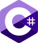

<picture>
  
</picture>

# C# Basics - January 2022

Start Date: 08.01.2022

End Date: 27.02.2022

## About course 

Курсът "Programming Basics" дава начални умения по програмиране, необходими за всички технологични специалности в Софтуерния университет. Това включва писане на програмен код на начално ниво (basic coding skills), работа със среда за разработка (IDE), използване на променливи и данни, оператори и изрази, работа с конзолата (четене на входни данни и печатане на резултати), използване на условни конструкции (if, if-else) и цикли (for, while, do-while).

## Lectures 

\- 01. First Steps in Coding (Lab) - 08.01.2022, lecturer Sanya Kasarova 

\- 01. First Steps in Coding (Exercise) - 09.01.2022, lecturer Ivet Valcheva 

\- 02. Conditional Statements (Lab) - 15.01.2022, lecturer Sanya Kasarova

\- 02. Conditional Statements (Exercise) - 16.01.2022, lecturer Ivet Valcheva

\- 03. Nested Conditional Statements (Lab) - 22.01.2022, lecturer Sanya Kasarova

\- 03. Nested Conditional Statements (Exercise) - 23.01.2022, lecturer Ivet Valcheva

\- 04. For Loop (Lab) - 29.01.2022, lecturer Sanya Kasarova

\- 04. For Loop (Exercise) - 30.01.2022, lecturer Ivet Valcheva

\- 05. While Loop (Lab) - 05.02.2022, lecturer Sanya Kasarova

\- 05. While Loop (Exercise) - 06.02.2022, lecturer Ivet Valcheva

\- 06. Nested Loops (Lab) - 12.02.2022, lecturer Sanya Kasarova

\- 06. Nested Loops (Exercise) - 13.02.2022, lecturer Ivet Valcheva

\- Exam Preparation - 19.02.2022, lecturer Ivet Valcheva

\- Preliminary Exam - 19-20.02.2022

\- Regular Exam - 26-27.02.2022

## Links 

[SoftUni course page](https://softuni.bg/trainings/3620/programming-basics-with-csharp-january-2022#lesson-36460)

[SoftUni Judge system](https://judge.softuni.org/Contests/#!/List/ByCategory/15/Programming-Basics)

[Facebook group of course](https://www.facebook.com/groups/PBwithCsharpJanuary2022)

[Discord group of course](https://discord.gg/xBY2YMB3Jg)

[Paste Bin](https://pastebin.com/)

